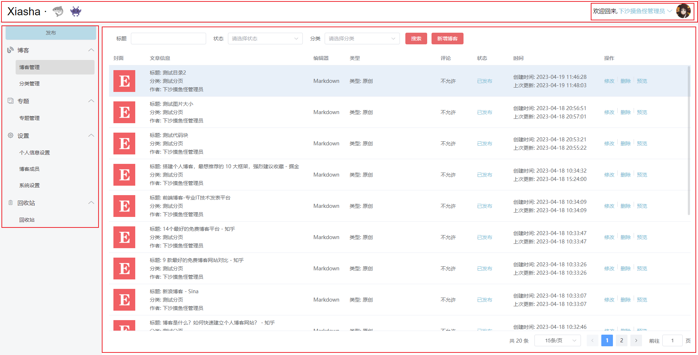
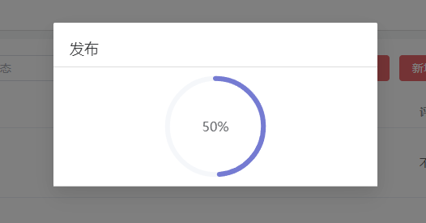
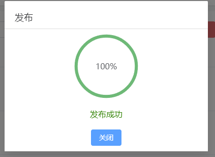
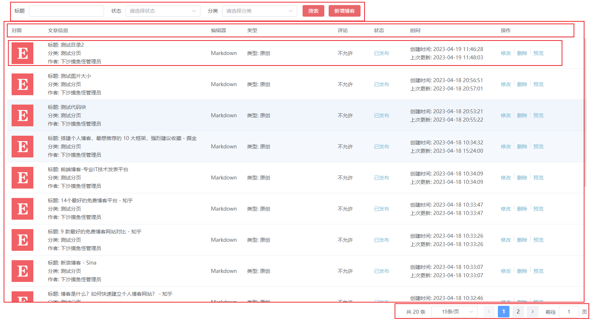

## 熟悉前端项目的个人记录
项目是一个简单的个人博客系统，包括管理端和访客端。

### 公共部分

#### 封装Request 以及 路由

这部分主要是介绍封装 axios，用于发起请求的 Request 脚本，更有助于理解在前端项目中如何对后端发起请求。封装 axios 的过程中，首先要确定传输数据的类型，可以是form表单，也可以是json格式，也可以是文件格式，根据不同的数据格式来创建一个请求的实例，创建请求实例的时候需要指定 baseURL 和 超时时间，主要是设置头部信息，头部信息中需要填入之前确定的文件格式。之后是两次拦截，分别是请求拦截和响应拦截，**拦截器**的格式可以在 axios 官网找到。在路由部分，在每次路由跳转之前，就需要检测 userInfo 是否存在，如果不存在并且路由不是去往登录界面，则需要跳转到登录界面进行登录。以上的具体的代码在Request.js 和 路由的 index.js 中。

#### Dialog组件

Dialog组件是一个可以被公共使用的提示弹窗，用在了博客编辑与新增，分类编辑与新增，专题的新增与修改，个人信息部分的修改密码，博客成员的新增与修改这几项功能，Dialog组件提供了公共的头部，可以选择有无的底部按钮部分，有无关闭按钮等部分，此外还可以在中间部分加入任意其他组件，这里用到了 <slot></slot> 占位符，除此之外，还可以将需要的按钮以数组的形式传进来，后面在使用到这个组件时，会进行提示。

#### Table组件

Table组件是用于展示列表数据结构的一个公共组件，我们借用了 elements-plus 中的 el-table 以及 el-table-column，并且还借助了 <slot></slot> 占位符，这里在仔细看过代码之后，有一些记录，所以将这一组件的代码放在下面，并在相应的地方做一些注释，代码在粘贴使用的时候，**请务必把注释去掉以保证正常运行**

```vue
<template>
  <div>
    <el-table ref="dataTable"		// 这是 vue 的模板引用，可以将一个响应对象与该元素进行绑定，以获取对该元素的一些操作，这里是为了实现表格中的勾选框而设计的，在本项目中并没有使用，其暴露的 setCurrentRow 方法也没有在父组件中进行调用。
              :data="dataSource.list || []"		// 是表格的 列表数据， 可以在 elements-plus 官方文档找到
              :height="tableHeight"
              :stripe="options.stripe"		// 斑马纹选项
              :border="options.border"		// 竖直方向边框的选项
              header-row-class-name="table-header-row"	// 表头行的 className 的回调方法，也可以使用字符串为所有表头行设置一个固定的 className。
              highlight-current-row		// 是否高亮当前行
              @row-click="handleRowClick"		// 当某一行被点击时会触发该事件， 回调参数包含 row, column, event
              @selection-change="handleSelectionChange">	// 当选择项发生变化时会触发该事件 回调参数是 selection
      <!--selection选择框-->
      <el-table-column v-if="options.selectType && options.selectType == 'checkbox'"
                       type="selection"
                       width="50"
                       align="center"></el-table-column>
      <!--序号-->
      <el-table-column v-if="options.showIndex"
                       label="序号"
                       type="index"
                       width="60"
                       align="center"></el-table-column>
      //  以上两个列是供勾选当前列时使用的，在本项目中 table 的作用主要是 display， 所以上面两个没有使用到。
      <!--数据列-->
        // 以下是循环一个 表示不同列 的数组
      <template v-for="(column, index) in columns">
        <template v-if="column.scopedSlots">
          <el-table-column :key="index"
                           :prop="column.prop"		// prop 在 el-table-column 元素中间没有其他值时才起作用，会自动去寻找 表格数据中的 prop 键值，可参考官方文档进行理解，当元素中间有其他要填充的内容时，这个就会被覆盖
                           :label="column.label"	// 列名
                           :align="column.align || 'left'"
                           :width="column.width">
            <template #default="scope">			// 这里主要用到了 el-table-column 的插槽知识， 与vue 插槽部分的知识， # 是 v-slot 的缩写，这里实际上是两层插槽，是在 el-table-column 提供的插槽基础上，又添加了一层具名插槽，el-table-column 组件的插槽数据需要用 #default将其提取出来， 这里的socpe 实际上是 {row, $index, column} 在官网有提及， 在使用的时候可以用本组件中的形式，也可以用单独的形式，而后再使用一个 具名插槽，将每一行的数据row 和索引 index 暴露给父组件，可以通过 查看 vue插槽以及el-table 部分的插槽加深印象。
              <slot :name="column.scopedSlots"
                    :index="scope.$index"
                    :row="scope.row">
              </slot>
            </template>
          </el-table-column>
        </template>
        <template v-else>
          <el-table-column :key="index"
                           :prop="column.prop"
                           :label="column.label"
                           :align="column.align || 'left'"
                           :width="column.width"
                           :fixed="column.fixed">
          </el-table-column>
        </template>
      </template>
    </el-table>
    <!-- 分页 -->
    <div class="pagination"
         v-if="showPagination">
      <el-pagination v-if="dataSource.totalCount"		// 这一部分是底部的换页选项
                     background		// 是否为分页按钮添加背景色
                     :total="dataSource.totalCount"		// 总条目数
                     :page-sizes="[15, 30, 50, 100]"		// 每页显示个数选择器的选项设置
                     :page-size="dataSource.pageSize"		// 最新版本中以及移除
                     :current-page.sync="dataSource.pageNo"		// 当前页数 .sync 是一个语法糖， 可以看文档
                     layout="total, sizes, prev, pager, next, jumper"	// 	组件布局，子组件名用逗号分隔
                     @size-change="handlePageSizeChange"	
                     @current-change="handlePageNoChange"
                     style="text-align: right"></el-pagination>
    </div>
  </div>
</template>

<script setup>
import { ref } from "vue";

const emit = defineEmits(["rowSelected", "rowClick"]);
const props = defineProps({
  dataSource: Object,
  showPagination: {
    type: Boolean,
    default: true,
  },
  options: {
    type: Object,
    default: {
      extHeight: 0,
      showIndex: false,
    },
  },
  columns: Array,
  fetch: Function, // 获取数据的函数
  initFetch: {
    type: Boolean,
    default: true,
  },
});

const radioSelectRowIndex = ref(null);

//顶部 60 , 内容区域距离顶部 20， 内容上下内间距 15*2  分页区域高度 46
const topHeight = 60 + 20 + 30 + 46;

const tableHeight = ref(
  props.options.tableHeight
    ? props.options.tableHeight
    : window.innerHeight - topHeight - props.options.extHeight
);

const dataTable = ref();

//行点击
const handleRowClick = (row) => {
  emit("rowClick", row);
};

//多选
const handleSelectionChange = (row) => {
  emit("rowSelected", row);
};

//切换每页大小
const handlePageSizeChange = (size) => {
  props.dataSource.pageSize = size;
  props.dataSource.pageNo = 1;
  props.fetch();
};
// 切换页码
const handlePageNoChange = (pageNo) => {
  props.dataSource.pageNo = pageNo;
  props.fetch();
};
//设置行选中
const setCurrentRow = (rowKey, rowValue) => {
  let row = props.dataSource.list.find((item) => {
    return item[rowKey] === rowValue;
  });
  dataTable.value.setCurrentRow(row);
};
//将子组件暴露出去，否则父组件无法调用
defineExpose({
  setCurrentRow,
});

//初始化
const init = () => {
  if (props.initFetch && props.fetch) {
    props.fetch();
  }
};
init();
</script>

<style lang="scss">
.pagination {
  padding-top: 10px;
}
.el-pagination {
  justify-content: right;
}

.el-table__body tr.current-row > td.el-table__cell {
  background-color: #e6f0f9;
}

.el-table__body tr:hover > td.el-table__cell {
  background-color: #e6f0f9 !important;
}
</style>
```

关于这一组件的使用还需要结合项目中的使用过程加深理解，例如自定义一个属性列，并设置列宽，每一列的界面布局等等。

### 管理端

管理端的主要功能有：用户登录，新增博客，新增分类，新增专题，个人信息设置，用户管理，系统设置和回收站。接下来的内容是记录每一个功能的实现流程，供个人面试时使用。

#### 用户登录

关于登录界面，将从界面布局和登录功能两方面记录。登录界面的设计比较简单，外观如下：


##### 界面布局

在界面组件的选择上，我们选择了 element-plus 组件库来提升整体的美观程度。我们的登录界面包含一张大的背景图片和一个用户登录 panel，主要布局都在登录 panel这边。首先记录比较简单的大图背景，这部分的 css用到了如下代码：

```css
width: 100%;		// % 用来定义基于包含块（父元素）宽度的百分比
height: calc(100vh);	// calc函数用于动态计算长度值，vh的意思是 viewpoint height，视窗高度，1vh=视窗高度的1% 
background-size: cover;		// 在background-size中 cover为保持图像的纵横比并将图像缩放成将完全覆盖背景定位区域的最小大小。
background-position: center;	// 设置背景图像的起始位置。
background-image: url('文件路径')；
```

我们在代码中的每一行都进行了注释，来解释这一行样式的作用。

之后是用户登录 panel，这一部分包含用户登录和一个el-form表单块，每个el-form中包含几个el-form-item组件，给出这一部分的 css 代码：

```css
.login-panel{
    float: right;	// 用户登录 panel 浮于整个界面右侧
    width: 350px;	// 设置 panel 的宽度为 350 像素，固定值
    margin-right: 100px;	// 为了与界面右侧保持一定的宽度
    padding: 20px;
    margin-top: 150px;
    border-radius: 5px;		// 设置圆角
    background: rgba($color: #fff, $alpha: 0.8);	// 设置背景透明
    box-shadow: 2px 2px 10px #ddd;		// 设置盒子阴影

    .login-title{
        font-size: 20px;
        text-align: center;
        margin-bottom: 10px;
    }

    .check-code-panel{
        width: 100%;
        display: flex;
        align-items: center;
        .input-panel{
            flex: 1;
            margin-right: 10px;

        }
        .check-code{
            // height: 30px;
            // margin-right: 2px;
            cursor: pointer;		// 定义了鼠标指针放在一个元素边界范围内时所用的光标形状， pointer为手型
        }
    }
}
```

##### 逻辑功能

接下来介绍逻辑功能，可以参考 element-plus 官网的 form 表单校验部分，这里只详细记录界面用户登录、记住密码等的逻辑流程，这里用到的第三方库是vue-cookie，用到的密码加密工具是 md5。主要逻辑如下：

界面初始化的时候，会使用vue cookie 检查有没有先前的没过期的登录信息 logInfo，如果有，我们则把表单中的用户名、密码、以及是否记住密码信息赋值，如果没有则跳过，正常初始化。然后是点击登录按钮时触发的逻辑，首先是表单的校验，如果当前表单合法，则进行后续操作，如果不合法，则会提示用户表单不合法；当表单合法时，首先会从 logInfo 中获取信息，并提取 logInfo 中的密码，如果 logInfo 不存在，则密码为空，这时检查 表单中的密码和 logInfo 中的密码是否一致，如果不一致，则证明密码是最新输入的， 需要对密码进行 md5 的加密。然后将登录参数设置完毕，包括用户名，密码和随机生成的验证码。如果都正确则证明登录成功，否则不成功，会提示用户。成功之后，会设置 1.5s 后进行页面跳转，然后，将登录接口的返回信息作为对象 存到 另外一个cookie中 uerinfo，表示当前会话的用户是哪一位，并且在这时判断是否记住密码，如果记住，则将当前用户的登录信息保存7天，不记住的话 loginfo 则没有信息。

在这里需要记住两个存到cookie中的信息，一个是 logInfo，用于记录用户的登录信息，是跟**是否记住密码**相关联的，记住密码意味着下次登录的时候就能获取先前的登录信息，就可以使用 logInfo，这个的存活时间是7天；另外一个是 userInfo，这个是用于记录当前会话的用户是谁，其存的信息是登录方法的返回值，用于后续判断博客是否归当前用户所有，以实现 **区别不同用户行为 ** 的功能，这个的存活时间是当前浏览器会话结束。

#### 框架页

框架页的结构如下，不同部分已经使用红色框已经标记出来，在框架页的实际中，只需要考虑顶部和左边一部分功能的实现，右侧大半部分都是供不同组件的展示，组件之间的切换是通过左边栏的选择来实现的，所以在**框架页**部分我们主要介绍顶部的功能以及左侧路由的功能。



##### 界面布局

首先是顶部，顶部主要包含两部分，左侧的首页 Logo，以及右侧的用户信息，用户名称部分可以进行点击并进入个人信息或者退出当前用户。首先介绍这部分的css代码，并给出每一行的具体含义。

```css
.header{
        border-bottom: 1px solid #ddd;
        display: flex;		// 弹性布局
        align-items: center;		// 上下居中
        justify-content: space-between;		// 左右上，两端对齐
        .logo{
            font-family: Arial, Helvetica, sans-serif;
            padding-left: 0;
            font-size: 30px;
            margin: 0 0 0 0;
        }
        .user-info{
            display: flex;
            align-items: center;		// 上下居中
            margin-right: 0;
            .welcome-back{
                font-size: 16px;
                height: 22px;
                // padding: 0;
                margin-right: 2px;
            }
            .nick-name{
                height: 16px;
                color: rgb(102, 187, 212);
                font-size: 16px;
                cursor: pointer;
                .icon-open{
                    height: 20px;
                }
            }
            .avatar{
                margin-left: 10px;
                width: 40px;
                height: 40px;
                img{
                    border-radius: 20px;
                    width: 100%;
                }
            }
        }
    }
```

```css
.left-aside{
            padding: 0px 15px;	// 上下，左右。
            width: 280px;
            .post-btn{
                background: #B1D9E6;
                // color: #fff;
                height: 40px;
                width: 100%;
                border-radius: 5px;
                // margin: 2px;
            }

            .menu-panel{
                margin-top: 5px;
                ul, li{
                    padding: 0px;
                    margin: 0px;
                    list-style: none;		//设置所有的列表属性。
                }

                .menu-title-p{
                    padding: 0px, 5px;
                    cursor: pointer;
                    line-height: 45px;
                    display: flex;
                    margin: 5px;
                    .iconfont{
                        font-size: 18px;
                        color: #91949a;
                    }

                    .menu-title{
                        flex: 1;
                        color: #3f4042;
                        margin-left: 10px;

                    }
                    .open-close{
                        width: 20px;
                        font-size: 16px;
                    }
                }

                .menu-title-p:hover{		// 当鼠标移到这个元素的时候
                    background: #ddd;
                    border-radius: 4px;
                    margin: 5px;
                }
                .sub-menu{
                    margin-left: 23px;
                    font-size: 14px;
                    .sub-menu-item{
                        padding: 0 10px;
                        display: block;
                        cursor: pointer;
                        line-height: 40px;
                        text-decoration: none;		// 跳转 去掉下划线
                        color: #3f4042;
                        margin: 5px;
                    }
                    .active{
                        background: #ddd;
                        border-radius: 4px;
                        margin: 5px;
                    }
                    .sub-menu-item:hover{
                        background: #ddd;
                        border-radius: 4px;
                        margin: 5px;
                    }
                }
                
                
            }
        }
```

##### 逻辑功能

这一部分的主要功能是发布功能，用户的退出，点击左边栏的跳转，跳转时的选中提示，左边栏的收起与展开功能，用户的个人信息跳转实际上是跟点击个人信息设置是一致的。

###### 发布功能

这里是点击发布按钮时的一个功能，是通过调用服务器的方法，把当前博客中的文章、分类、专题以及用户信息自动打包成一个完整的可部署的文件包，我们在前端所要完成的功能是调用后端提供的打包接口，并展示打包的成功与否和进度，进度的展示大概如下：



我们要做的是在固定时间间隔内去查看打包的进度，并实时展示到进度条，这里用到了我们创建的公共组件 Dialog，这里用到了 setInterval 来每隔 1s 去调用后端提供的检测进度方法，来更新进度条，进度条的颜色渐变是通过自定义颜色数组实现的，并借助了 el-progress 组件，只需要根据官方文档提供相应的数据结构传入即可。

###### 用户的退出

当用户点击退出的时候，就会调用 logout 方法，这里我们封装了一个 Confirm 功能，利用的是 element-plus 的 ElMessageBox组件，可以在官方文档中找到该组件的 confirm 方法，我们在此组件和方法之外，重新封装了组件与方法，并绑定在了全局，用来提示用户是否**确定退出登录**，当退出成功之后，就会重新回到 login 界面下。

###### 界面的跳转和选中的提示以及收起和展开的功能

左边栏是一个二层的树状结构，有多个根节点，每个根节点下只有一层孩子节点，所以在渲染的时候，可以先遍历根节点，作为列表元素的第一级，之后对每个孩子节点进行遍历，也进行列表渲染，我们给出了一个根节点及其孩子节点的结构：

```javascript
{
    title: "博客",
    icon: "icon-blog",		// 用来选择 图标
    open: true,				// 用来设置 打开 或者 关闭的 箭头图标
    children: [
        {
            title: "博客管理",
            path: "/blog/list"
        },
        {
            title: "分类管理",
            path: "/blog/category"
        },
    ]
}
```

为列表的第一级绑定点击事件，初始的时候每个列表都是展开的，点击时将 open 属性置反，就可以获得箭头图标的动态变化效果了，在点击 children 属性对应的元素的时候，可以设置路由跳转，到对应的 path 下，这里的 path 也可以用于选中提示功能的实现，我们选择获取当前路由的 path，并于每个 children 中的 path 进行比对，相同则证明是选中当前的元素，则可以将其 class 后面增加 active 的后缀，通过对应的 css 来加深那一栏。

###### 用户个人信息跳转

这个功能比较简单，跟左边栏的点击 **个人信息设置** 是一致的，所以直接进行路由变化就可以了。

#### 博客页面



博客页面有上下两部分，顶部是一个包含搜索功能、新增功能的小部分区域，这里的状态包含两种---草稿/已发布，而分类则是根据实际存在的类别实时进行获取的，搜索的功能是调用的是获取 **博客列表** 接口，这一方法可以提供带条件的搜索。在这里我们用到了一个 Table 组件，来展示获取到的博客列表，关于 Table 组件我们在公共部分进行介绍。

